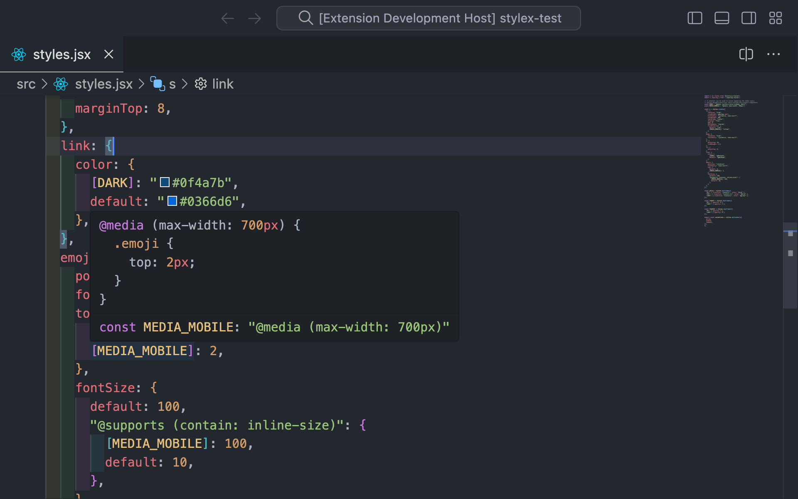
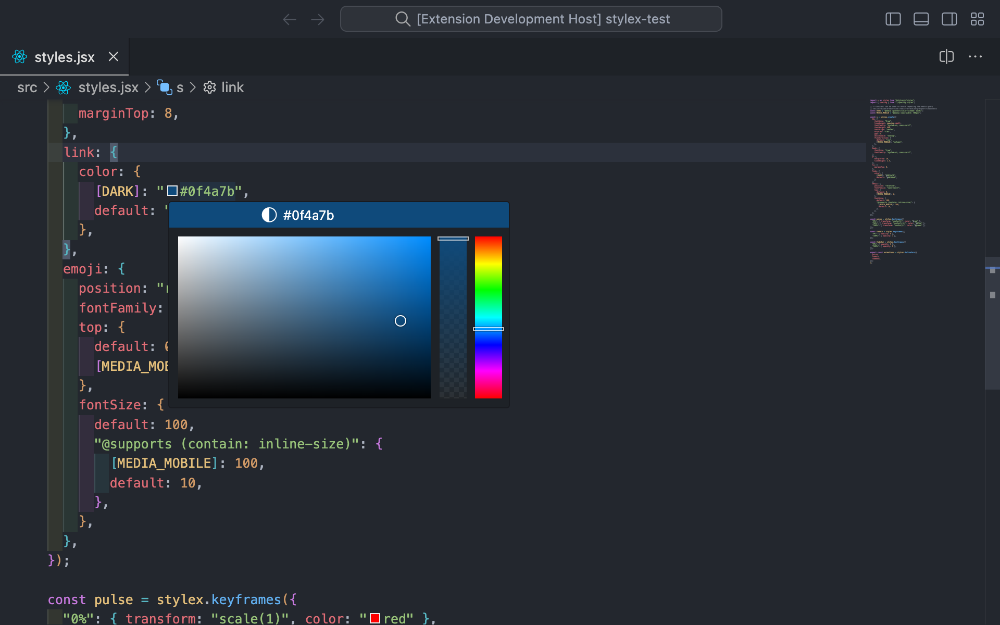
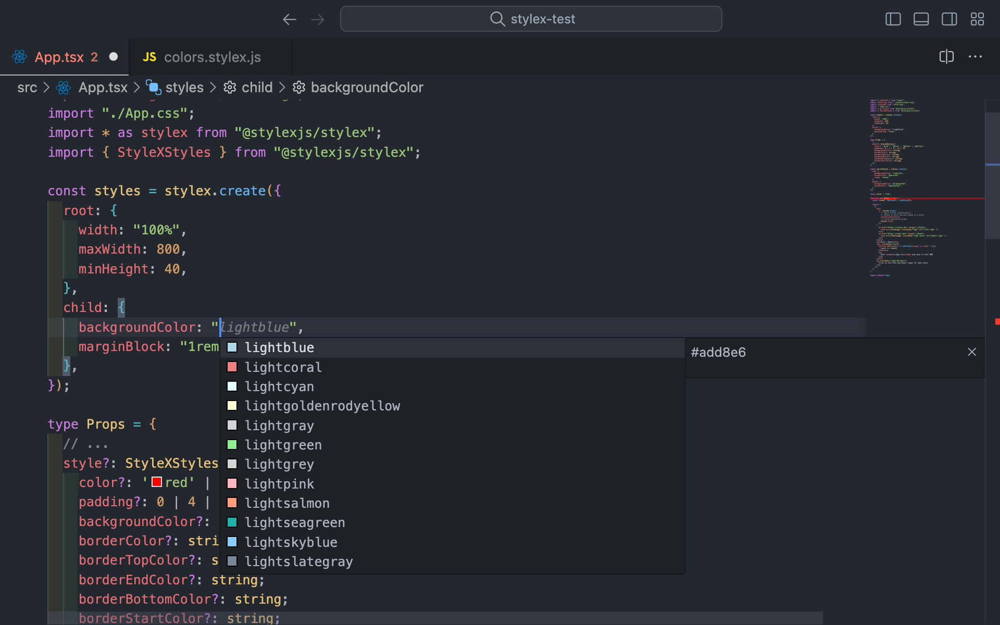

# StyleX Intellisense

StyleX Intellisense enhances your StyleX development experience by providing advanced features such as autocomplete, hover previews, and color decorators.

## Installation

**[Install via the Visual Studio Code Marketplace →](https://marketplace.visualstudio.com/items?itemName=yash-singh.stylex)**

In order for this extension to work, make sure you have [**`@stylexjs/stylex`** installed](https://stylexjs.com/docs/learn/installation/) in your workspace.

## Functionality

### Hover Previews

See the generated CSS for a CSS property by hovering over it.



### Color Decorators

Change values of colors using a color picker.



### Auto Complete

Autocomplete styles



## Configuration

### `stylex.includedLanguages`

Enable features in languages that are not supported by default. Add a mapping here between the new language and an already supported language.

```json
{
  "stylex.includedLanguages": {
    "plaintext": "javascriptreact"
  }
}
```

### `stylex.aliasModuleNames`

List of custom module names that should be considered as the StyleX package for detecting StyleX workspaces and imports.

```json
{
  "stylex.aliasModuleNames": ["@my-org/stylex"]
}
```

### `stylex.useRemForFontSize`

Should `px` values for fontSize be converted to `rem`? It is considered a best practice to use rem for font sizes to allow users to scale the font size up or down.

```json
{
  "stylex.useRemForFontSize": false
}
```

### `stylex.hover`

Enable/disable hover support for StyleX classes and keyframes.

```json
{
  "stylex.hover": true
}
```

### `stylex.suggestions`

Enable/disable autocomplete suggestions.

```json
{
  "stylex.suggestions": true
}
```

### `stylex.colorDecorators`

Enable/disable whether the editor should render color decorators for styles.

```json
{
  "stylex.colorDecorators": true
}
```
